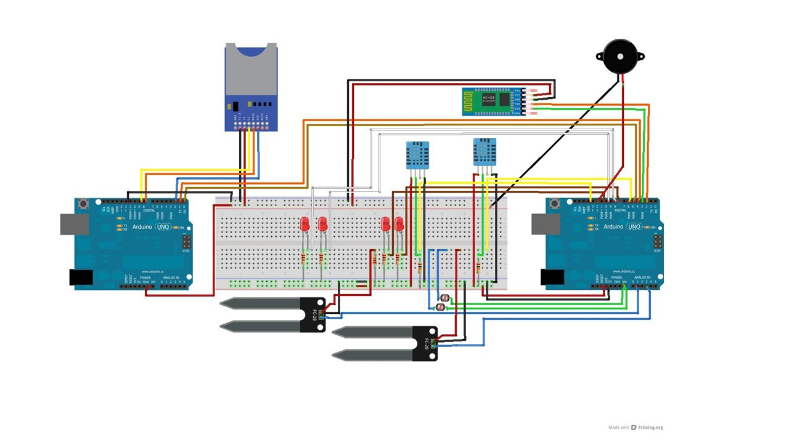
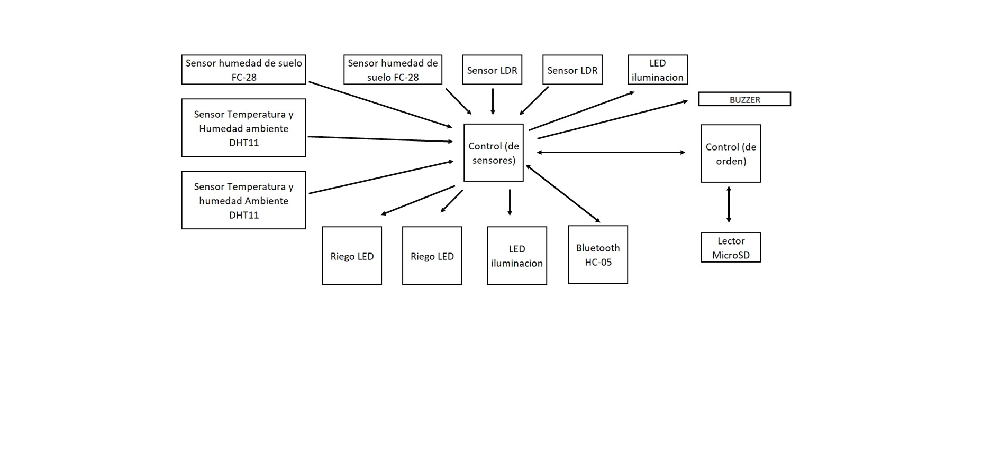
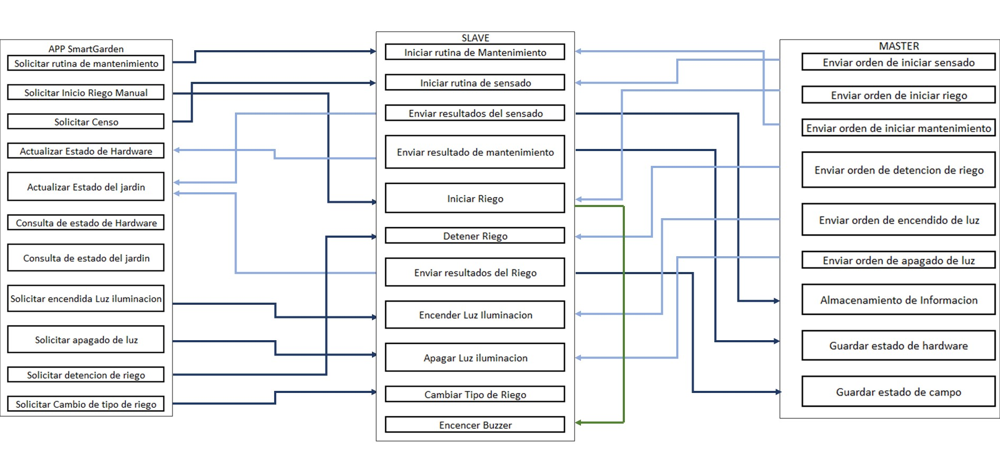
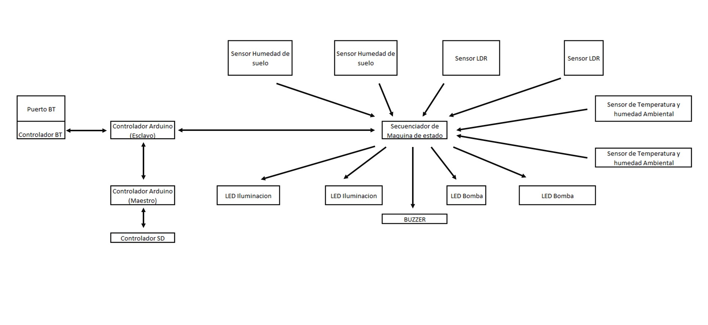
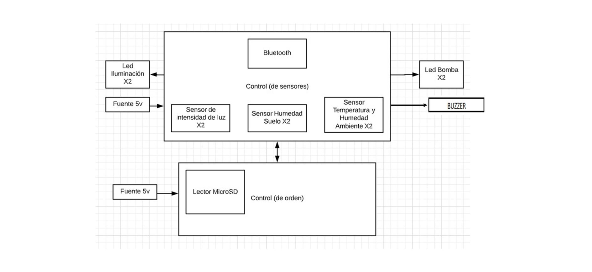
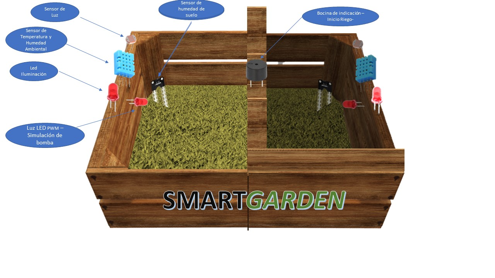
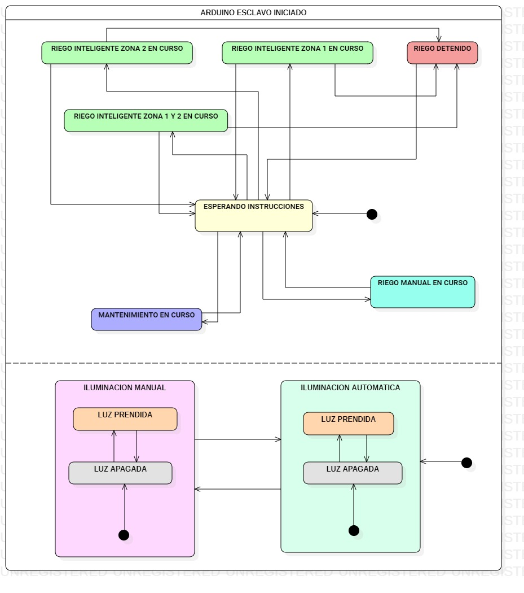

# M2 - SmartGarden
Proyecto de la materia Sistemas Operativos Avanzados.

# Presentación

  ## Integrantes:
    Borda, Jonathan Matias  36274686 jonathanmatiasborda@gmail.com
    Olivera, Florencia      41262196 o.florencia123@gmail.com
    Lancuba, Emiliano       38465504 lancuba.emiliano@gmail.com
    Gómez, Nicolás          39413982 nneegomez@gmail.com
    Amato, Luciano Salvador 40378763 luchiiamato@gmail.com

# Objetivos del sistema:
  El principal objetivo del sistema es mantener el parque hidratado, minimizando tanto trabajo humano como también consumo de agua.
  
# Descripcion del proyecto:

  ## ¿Qué es el proyecto?
  Sistema de automatización de riego para parques.
  
  ## ¿Qué hace?
  Este proyecto consta de la automatización de un riego optimizado para parques. A su vez, desde la aplicación móvil, se podrá consultar los resultados del ultimo riego y el estado del hardware que compone el sistema. 
  
  ## ¿Qué problema soluciona?
  La utilización de recursos limitados, tal como es el agua, hoy en dia comienza a ser un problema para el mundo. Por eso nuestro proyecto buscará, mediante mediciones rutinarias, el mejor momento para realizar el riego, optimizando el tiempo y el agua para no desperdiciar dichos recursos. 
  
  ## ¿Cómo se usa?
  El usuario podrá consultar estado de las condiciones del parque, aspersores y sensores. Respecto al sistema embebido, se encargará de todo lo demás, recopilará la información de los sensores integrados puede tomar decisiones para elegir el mejor momento de riego y optimizar el consumo de agua. En caso que se requiera, se podra optar por un riego manual sin alterar la informacion recopilada para la toma de decisiones.

# Descripcion Tecnica:
  El sistema contará con dos sensores de humedad para informar en tiempo real el porcentaje de humedad del suelo en lugares específicos, dos sensores de temperatura y luminosidad. Además, dos luces led actuarán de bomba de agua y un buzzer como informante de que el riego comenzo. Como agregado, se cuenta con dos Led para iluminacion.

  El sistema embebido será un dispositivo Arduino quien procese los datos de los sensores mencionados y decida como activar los actuadores para tener un riego óptimo. También, el embebido en momentos donde no tenga demanda de procesamiento podrá realizar una tarea de revisión de los componentes para controlar el correcto funcionamiento. 

# Descripcion de partes:

  ## Actuadores
    Luces led x 2(salidas PWM) - simulacion de bombas
    Luces led x 2(salidas digitales) - iluminacion exterior
    Buzzer (salida digital) - aviso de comienzo de riego
    
  ## Sensores
    Sensor de humedad de suelo FC-28 x 2 
    Sensor de humedad y temperatura ambiental DHT-11 x 2
    Sensor de intensidad de luz GL55 x2
   
  ## Elementos a utilizar - ¿Qué función cumplen en el sistema?
    •Arduino uno
    •Dispositivo Bluetooth HC-05 para la comunicación entre el sistema embebido y la aplicación móvil.
    •2 sensores de humedad de suelo FC-28, 2 sensores de temperatura DHT11 y 2 sensores de intensidad de luz ldr para medir
    las variables a tener en cuenta a la hora de tomar una decisión respecto al riego del parque.
    •2 luces led para simular el riego de los aspersores, variando su intensidad según caudal de agua.
    •2 luces led para la iluminación del parque en horarios nocturnos.
    •1 buzzer para dar aviso de comienzo de riego
    •Soporte de tarjetas microSd para almacenamiento de informacion
  
  
  ## Diagrama de Conexión
  
  ## Diagrama Funcional
  
  ## Diagrama Software
  
  ## Diagrama lógico
  
  ## Diagrama Físico
  
  ## Esquema físico
  
  
# Firmware:
## Diagrama de estados
En el diagrama se puede observar el estado del dispositivo en un momento dado, y los posibles estados al cual puede pasar. Por estado se debe entender como las diferentes combinaciones de información que la maquina puede mantener.

## Automatizacion de riego realizada en Arduino 
La primera parte del proyecto consiste en la automatización de riego que actúa mediante cálculos matemáticos realizados en base a los datos censados para poder determinar el momento ideal para efectuar el riego, generando así una alta eficiencia en dicha actividad y un bajo consumo de agua.
El proyecto consta de dos plaquetas Arduino uno, implementadas de forma Maestro – Esclavo, en la cual el maestro se encarga pura y exclusivamente en el control del esclavo y también del procesamiento de datos que este arroja. Este procesamiento de datos consiste en diversos cálculos matemáticos para poder, como ya comentamos, encontrar el momento oportuno de riego. En cuanto al esclavo, se encarga de la realización de los sensos correspondientes, el accionar de los actuadores y de la comunicación con el dispositivo bluetooth.
La comunicación entre el Arduino maestro y el Arduino esclavo es mediante una simulación serial.
Pasaremos a detallar la actividad del maestro:
El maestro cuenta con un adaptador de tarjeta microSD para el almacenamiento de información, que será útil para la toma de decisiones y para la realización del riego automático. Luego de cada censo, en el archivo correspondiente de cada zona, se guardan los datos que los sensores detectaron.
Como ya dijimos, el maestro esta conectado al esclavo, del cual recibe datos en todo momento del estado del campo. Dichos datos, provenientes de los sensores de humedad de suelo (FC-28), humedad y temperatura ambiental (dht-11) y sensor de luz ldr (gl55), serán ponderados de acuerdo con su importancia en el estado del jardín. Esto consiste en darle una prioridad a cada dato de los sensores, como máxima prioridad al sensor de luz (para evitar los riegos durante la luz del sol), luego a la humedad de suelo (para no regar cuando la humedad es relativamente baja o viceversa) y por último la temperatura y humedad ambiental.  Esto nos permitirá realizar el calculo de efectividad de riego.
La rutina de censado fue establecida de la siguiente forma, por cada loop evaluamos si el tiempo transcurrido supera un valor predefinido de intervalo entre censos,  si lo supera, realiza el censo, sino, lo evaluara el próximo loop.
Lo mas importante del maestro, es el calculo de efectividad. Este calculo consiste en tomar los valores de temperatura, humedad ambiente , humedad suelo, y luz; con esos valores, calculamos un valor de representación con respecto a su máximo. Aquí entra en participación las prioridades definidas anteriormente que se multiplican por estas representaciones arrojando así un porcentaje de efectividad para riego. Tiene una lógica positiva, cuanto mas cercano a 100 es, mas efectivo. Todos estos datos serán guardados en la sD para futuras consultas, al igual que los censos. 
Con los datos mencionados de efectividad se evalúan los riegos en zonas, pero también entra un juego otras variables correspondientes al momento en el que se va a regar. Por ejemplo la luz y la humedad actual. Esto quiere decir que si la efectividad de riego nos da un 70% en este momento, pero al censar vemos que esta por llover (humedad ambiental alta), no realizaremos el regado.
Otra de las funciones importantes que realiza el maestro es poder reconocer variaciones de los sensores y poder procesar esa información, como por ejemplo, reconocer el momento del día de acuerdo a la luz, si esta en ascenso o descenso. Tratando de evitar así, los cambios bruscos de algún sensor en nuestra recopilación de información. ¿Que quiere decir esto? Que se estableció un rango de valores el cual pueden variar los datos sin alterar nuestra base. 
En cuanto al esclavo, realiza las tareas de recopilación y envio de información. Es el encargado de la comunicación con el bluetooth, el encargado de realizar el censado correspondiente y también el encargado de accionar los actuadores, en nuestro caso la bocina cuando comienza el riego, y las luces PWM del riego. También tiene funciones como por ejemplo, realizar un mantenimiento de los sensores y de poder alterar los cambios en el tipo de riego. Ambos acciones son enviadas desde el dispositivo Android.

# Descripción de la Aplicación Android:
Esta segunda parte del proyecto consiste en una aplicación móvil que nos sirve de ayuda y de complemento para ejecutar, consultar y poner en practica todas funcionalidades de nuestro jardín inteligente. Nos ofrece la posibilidad de poner en actividad a los sensores y actuadores, como también, de consultar un registro histórico de los sucesos recientes. 
En principio, al iniciar la aplicación veremos una pantalla que contiene tanto el logo como el nombre de nuestra aplicación. 
[Foto de inicio]
Por unos segundos se podrá observar  y luego nos redireccionara a la pantalla de inicio
## Inicio
Dentro de esta pantalla de inicio se podrá crear una conexión con el Bluetooth del jardín, realizando un emparejamiento directo al componente bluetooth. No es necesario la búsqueda de cientos de dispositivos cuando solo nos interesa uno en este caso. No se puede interactuar estando sin conexión, por ende, lo único que se podrá hacer en este momento es conectarse al dispositivo.
Para ello debemos seleccionar la opción “Conectarse a SmartGarden”. Mientras el jardín este conectado a su alimentación, automáticamente se emparejaran los dispositivos.
[Foto de pantalla de inicio]
Como podemos observar nuestra pantalla de inicio esta compuesta por tres pestañas, HOME, SETTINGS y MAINTENANCE.
## HOME 
[foto de home] [Foto con los valores por zona]
Nuestra pantalla Home contara con una división en el centro de la pantalla en la que separa las dos zonas que cuenta nuestro jardín. En cada una de ellas podremos observar campos que serán completados en los momentos de finalización de riego o de senseo que constan de los siguientes valores: 
•	Temperatura Ambiental
•	Humedad Ambiental
•	Humedad de suelo
•	Luz Ambiental 
•	Luz Apagada
En esta pantalla, vamos a poder interactuar con el sistema de riego de las siguientes formas. Podremos observar el resultado de un riego, viendo la actualización del valor de humedad de suelo y podremos observar el resultado de la rutina de senseo, viendo allí, los valores correspondientes a cada zona.
## SETTINGS [Foto de settings]
La siguiente pantalla que veremos será donde podremos realizar las mayores interacciones con el dispositivo, nos permitirá no solo consultar datos sino poder ejercer alguna acción frente al jardín. Como se aprecia en la foto, vamos a poder mediante el accionar de los botones específicos, Iniciar riego manual, Detener el riego, Iniciar censo e Iniciar Mantenimiento. Cada una de ellas realizara la acción correspondiente sin afectar a los informes automaticos que realiza por si solo el Arduino. Luego, tendremos la opción de poder alterar los parametros de riego manual, estos son la duración en ms y la intensidad. Por ultimo, tenemos la posibilidad de seleccionar la configuración de tipo de riego entre dos opciones, riego continuo o riego intermitente. 
Iniciar riego manual -> Al presionar este botón, dará inicio mientras pueda a un riego manual con los parámetros seteados en la misma pantalla de Settings.
Detener riego -> Al presionar este botón, se finalizara el riego en ese mismo instante. 
Iniciar censo-> Cuando seleccionamos iniciar censo, damos comienzo a una rutina de acción de todos los sensores activos en el jardín, recibiendo por cada una de las zonas activas, la temperatura ambiental, la humedad del ambiente, la humedad de suelo y la luz ambiental.
Iniciar Mantenimiento -> La rutina de mantenimiento se realizara siempre y cuando el jardín este disponible para el mismo. Al realizar el mantenimiento podremos observar en la pestaña MAINTENANCE el resultado del mismo, que detallaremos a continuación.
Existen a disposición tres tipos de sensores del dispositivo Android que arrojara las siguientes funciones:
_El sensor de shake (acelerómetro) responde al agitar el celular realizara la rutina de Inicio de riego manualmente con los valores seteados. Si no fueron configurados aun, se realizara con parámetros por defecto.
_El sensor de proximidad, responde al realizar un movimiento frente al celular, detendrá instantáneamente al riego
_El sensor de luminosidad, responde a cualquier cambio de luz del ambiente, realizara la rutina de mantenimiento.
Por ultimo, la ultima pestaña disponible en nuestra aplicación
## MAINTENANCE
[Foto maintenance]
En esta pantalla tenemos la posibilidad de ver los resultados arrojados por la rutina de mantenimiento. Esta consiste en tres posibilidades:
_No se pudo realizar el mantenimiento porque el Arduino no lo logro hacer, por ejemplo, esta durante una rutina de riego automático
_El mantenimiento se realizo correctamente y no hay fallas en los sensores
_El mantenimiento se realizo correctamente y presento falla en algún sensor. En este caso, luego del mensaje de detección de error, podremos observar que sensor no esta funcionando correctamente.

# Manual de uso:
Al iniciar la aplicación SmartGarden, nos mostrara una pantalla en la cual tenemos que seleccionar nuestro dispositivo bluetooth correspondiente al jardín inteligente. 
(Se deberá contar con un dispositivo compatible con bluetooth 2.0 o superior)
Es necesario la activación del bluetooth para poder interactuar con la aplicación.
Luego de establecer conexión con el dispositivo, podremos observar la pantalla principal que contara con tres tabs o pestañas, cuyos nombres son Home, Settings y Maintenance. 
En la pantalla home, inmediatamente luego de conectarse tendremos a nuestra disposición un estado actual del terreno. Esto consiste en los siguientes valores por cada una de las zonas en cuestión (1 y 2):
•	Zona y estado
•	Humedad de suelo
•	Luminosidad
•	Temperatura y humedad Ambiental
	
## Iniciar Riego manualmente
Si queremos iniciar un riego manualmente tenemos dos opciones:
1-	Para iniciar un riego manualmente, lo podemos solicitar en la pestaña Settings, accionando el botón “Iniciar Riego Manualmente”
2-	Como alternativa, podemos utilizar los sensores propios del dispositivo. El inicio del riego manualmente se realiza automáticamente luego de que se “agite” el dispositivo, es decir, que responda al sensor de Shake (acelerómetro).
Ambas dos variantes de inicio de riego manual se realizaran teniendo en cuenta los parámetros de intensidad y duración definidos en la pestaña Settings. Si queremos realizar el riego en la primera vez que utilizamos la aplicación y no hay parámetros definidos, se realizara con unos valores por defecto.
## Detener Riego
Si queremos detener un riego ya comenzado tenemos dos opciones:
1.	En la pestaña Settings de la pantalla principal, podemos accionar el botón detener riego y finalizaría el mismo en ese instante.
2.	Como alternativa, podemos utilizar los sensores propios del dispositivo. Al implementar el sensor de proximidad del dispositivo celular, el riego finaliza de inmediato. 
(Generalmente el implementar el sensor de proximidad consiste en realizar un movimiento con la palma de la mano en la ubicación del sensor)
## Iniciar Censo
Si queremos consultar el estado del campo viendo los valores de humedad, luz y temperatura podremos solicitar un censo de los sensores. En la pestaña Settings de la pantalla principal, podemos accionar el botón Iniciar censo y luego recibiríamos los valores de cada sensor por zona.
## Iniciar Mantenimiento de sensores
Si queremos realizar un mantenimiento para consultar el estado de los sensores tenemos dos alternativas:
1-	Podremos accionar el botón “Iniciar Mantenimiento” en la pestaña Settings de la pantalla principal. El chequeo comienza de inmediato y se guarda hasta que el usuario inicie otro chequeo manual
2-	Como alternativa, podremos utilizar los sensores propios del dispositivo. En este caso, utilizaríamos el sensor de luminosidad, es decir, se detectara una modificación en la luz ambiental, iniciando la solicitud de inicio de mantenimiento.
Sensores a evaluar:
_Luces
_Bombas
_Sensores de temperatura
_Sensores de luz

El resultado del mantenimiento se podra observar en la pestaña Maintenance
## Configurar parámetros de riego
Si queremos configurar los parámetros de un riego manual lo podremos realizar en la pestaña Settings de la pantalla principal. 
La configuración de los parámetros consiste en poder cambiar los valores de duración, intensidad y tipo de riego. 
•	Si realizamos un cambio en la duración, se vera reflejado en el tiempo en que el riego estará activo. 
•	Si realizamos un cambio en la intensidad, se vera reflejado en la intensidad del riego. (Perceptible en la luz led que simula bomba)
•	Si realizamos un cambio en el tipo de riego, podemos escoger en riego por aspersión o riego continuo. Influirá en la forma en la que se moverán los aspersores. Puede influir tanto en el caudal de agua otorgado por cada zona y en el tiempo de riego.
## Consultas generales
¿Esta Regando?	 : Cada vez que un riego automático comienza, lo veremos reflejado en la pestaña home discriminado por zona. De la misma forma, podremos observar si dicho riego ya finalizo. Tenga en cuenta que no necesariamente las dos zonas realizaran el riego simultáneamente. 
¿Dónde puedo ver los resultados del ultimo riego? : Cuando un riego finaliza, en la pestaña Home de la pantalla principal podremos observar el estado del terreno evaluando cada sensor y cada zona. 
¿Qué sucede si dejo la aplicación en segundo plano?: Cuando la aplicación queda en segundo plano, no afectara en absoluto en la inteligencia del riego. Es decir, si tenia un riego programado para cierto momento en el cual estoy desconectado o en segundo plano, el riego se activara de todas formas. Sin embargo, no podremos comunicarnos con el jardín. Si queremos detener el riego, iniciar censo o realizar el mantenimiento mediante los sensores mientras esta en segundo plano, no tendría efecto en la aplicación, no seria posible. 
¿Qué sucede si me desconecto, es decir, si cierro la aplicacion? Cuando finalizamos la aplicación, se comunicara al jardín que el dispositivo fue desconectado y continuara funcionando normalmente. No se podrán modificar parámetros, no se podrá realizar censos manualmente y ni tampoco detener el riego sin el dispositivo Android conectado.  Las reacciones de los sensores del dispositivo tienen valor siempre y cuando se este conectado con el Arduino

# Conclusiones
