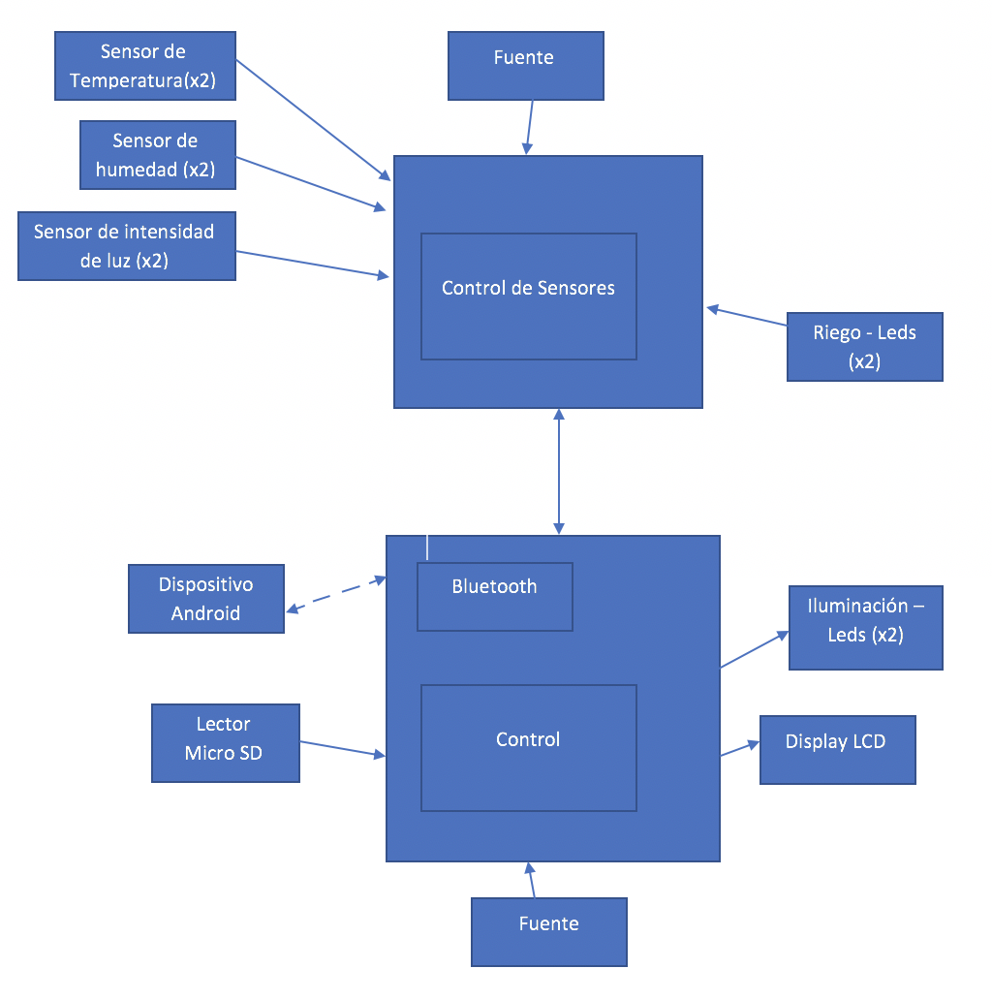

# M2 - SmartGarden
Proyecto de la materia Sistemas Operativos Avanzados.

# Presentación

  ## Integrantes:
    Borda, Jonathan Matias  36274686 jonathanmatiasborda@gmail.com
    Olivera, Florencia      41262196 o.florencia123@gmail.com
    Lancuba, Emiliano       38465504 lancuba.emiliano@gmail.com
    Gómez, Nicolás          39413982 nneegomez@gmail.com
    Salvador Amato, Luciano 40378763 luchiiamato@gmail.com

# Objetivos del sistema:
  El principal objetivo del sistema es mantener el parque hidratado, minimizando tanto trabajo humano como también consumo de agua.
  
# Descripcion del proyecto:

  ## ¿Qué es el proyecto?
  Sistema de automatización de riego para parques.
  
  ## ¿Qué hace?
  Este proyecto consta de la automatización de un riego optimizado para parques. A su vez, desde la aplicación móvil, se podrá consultar un estado, tanto actual como histórico, de las condiciones del parque, futuros riegos, estado de los aspersores y sensores.
  
  ## ¿Qué problema soluciona?
  La utilización de recursos limitados, tal como es el agua, hoy en dia comienza a ser un problema para el mundo. Por eso nuestro proyecto buscará, mediante mediciones rutinarias, el mejor momento para realizar el riego, optimizando el tiempo y el agua para no desperdiciar dichos recursos. 
  
  ## ¿Cómo se usa?
  El usuario podrá configurar horarios de riego desde la aplicación móvil, también podrá consultar estado de las condiciones del parque, aspersores y sensores. Respecto al sistema embebido, recopilará la información de los sensores integrados puede tomar decisiones para optimizar el consumo de agua.

# Descripcion Tecnica:
  El sistema contará con dos sensores de humedad para informar en tiempo real el porcentaje de humedad del suelo en lugares específicos, dos sensores de temperatura y luminosidad. Además, dos relés actuarán de bomba de agua y un display como informante.

  El sistema embebido será un dispositivo Arduino quien procese los datos de los sensores mencionados y decida como activar los actuadores para tener un riego óptimo. También, el embebido en momentos donde no tenga demanda de procesamiento podrá realizar una tarea de revisión de los componentes para controlar el correcto funcionamiento. 

  Desde un dispositivo android, un usuario tendrá la posibilidad de interartuar con el sistema embebido para poder configurar horarios de riego u ordenar la tarea de revisión de componentes.

# Descripcion de partes:

  ## Actuadores
    Luces led (salidas analógicas)
    
  ## Sensores
    Sensor de humedad de suelo
    Sensor de humedad y temperatura ambiental
    Sensor de intensidad de luz
    
  ## Elementos a utilizar - ¿Qué función cumplen en el sistema?
    •Arduino uno
    •Dispositivo Bluetooth HC-05 para la comunicación entre el sistema embebido y la aplicación móvil.
    •2 sensores de humedad de suelo FC-28, 2 sensores de temperatura DHT11 y 2 sensores de intensidad de luz ldr para medir
    las variables a tener en cuenta a la hora de tomar una decisión respecto al riego del parque.
    •2 luces led para simular el riego de los aspersores, variando su intensidad según caudal de agua.
    •2 luces led para la iluminación del parque en horarios nocturnos.
    •1 Pantalla lcd para monitoreo real del estado del terreno.
  
  ## Diagrama Funcional
  
  ## Diagrama Software
  
  ## Diagrama lógico
  
  ## Diagrama Físico
  
  ## Esquema físico
  
  
  
# Firmware:
  
# Descripción de la Aplicación Android:

# Manual de uso:

# Conclusiones
