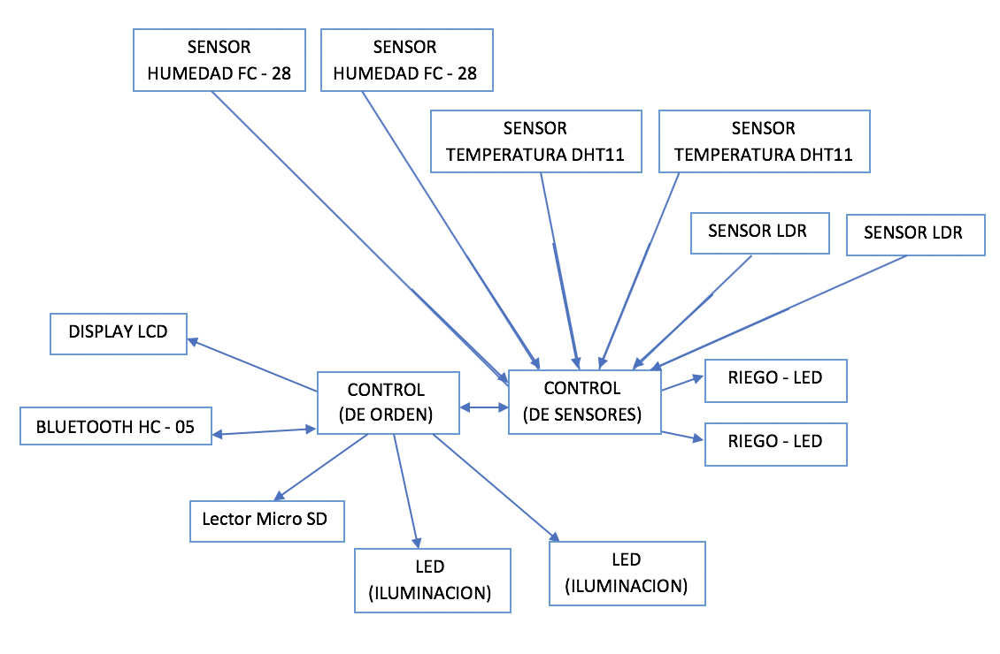

# M2 - SmartGarden
Proyecto de la materia Sistemas Operativos Avanzados.

# Presentación

  ## Integrantes:
    Borda, Jonathan Matias  36274686 jonathanmatiasborda@gmail.com
    Olivera, Florencia      41262196 o.florencia123@gmail.com
    Lancuba, Emiliano       38465504 lancuba.emiliano@gmail.com
    Gómez, Nicolás          39413982 nneegomez@gmail.com
    Salvador Amato, Luciano 40378763 luchiiamato@gmail.com

# Objetivos del sistema:
  El principal objetivo del sistema es mantener el parque hidratado, minimizando tanto trabajo humano como también consumo de agua.
  
# Descripcion del proyecto:

  ## ¿Qué es el proyecto?
  Sistema de automatización de riego para parques.
  
  ## ¿Qué hace?
  Este proyecto consta de la automatización de un riego optimizado para parques. A su vez, desde la aplicación móvil, se podrá consultar los resultados del ultimo riego y el estado del hardware que compone el sistema.
  
  ## ¿Qué problema soluciona?
  La utilización de recursos limitados, tal como es el agua, hoy en dia comienza a ser un problema para el mundo. Por eso nuestro proyecto buscará, mediante mediciones rutinarias, el mejor momento para realizar el riego, optimizando el tiempo y el agua para no desperdiciar dichos recursos. 
  
  ## ¿Cómo se usa?
  El usuario podrá consultar estado de las condiciones del parque, aspersores y sensores. Respecto al sistema embebido, se encargará de todo lo demás, recopilará la información de los sensores integrados puede tomar decisiones para elegir el mejor momento de riego y optimizar el consumo de agua.

# Descripcion Tecnica:
  El sistema contará con dos sensores de humedad para informar en tiempo real el porcentaje de humedad del suelo en lugares específicos, dos sensores de temperatura y luminosidad. Además, dos luces led actuarán de bomba de agua y un display como informante.

  El sistema embebido será un dispositivo Arduino quien procese los datos de los sensores mencionados y decida como activar los actuadores para tener un riego óptimo. También, el embebido en momentos donde no tenga demanda de procesamiento podrá realizar una tarea de revisión de los componentes para controlar el correcto funcionamiento. 

# Descripcion de partes:

  ## Actuadores
    Luces led (salidas analógicas)
    
  ## Sensores
    Sensor de humedad de suelo
    Sensor de humedad y temperatura ambiental
    Sensor de intensidad de luz
    
  ## Elementos a utilizar - ¿Qué función cumplen en el sistema?
    •Arduino uno
    •Dispositivo Bluetooth HC-05 para la comunicación entre el sistema embebido y la aplicación móvil.
    •2 sensores de humedad de suelo FC-28, 2 sensores de temperatura DHT11 y 2 sensores de intensidad de luz ldr para medir
    las variables a tener en cuenta a la hora de tomar una decisión respecto al riego del parque.
    •2 luces led para simular el riego de los aspersores, variando su intensidad según caudal de agua.
    •2 luces led para la iluminación del parque en horarios nocturnos.
    •1 Pantalla lcd para monitoreo real del estado del terreno.
  
  ## Diagrama de Conexión
  
  ## Diagrama Funcional
  
  ## Diagrama Software
  
  ## Diagrama lógico
  
  ## Diagrama Físico
  
  ## Esquema físico
  
  
  
# Firmware:
  
# Descripción de la Aplicación Android:

# Manual de uso:
## Antes de conectar con nuestro jardín :
Al iniciar la aplicación SmartGarden, nos mostrara una pantalla en la cual tenemos que seleccionar nuestro Smart garden. 
(Se deberá contar con un dispositivo compatible con bluetooth 2.0 o superior)
Es necesario la activación del bluetooth para poder interactuar con la aplicación.
## Luego de conectar al jardín : 
Al estar ya conectado, podremos observar las tres pestañas disponibles (Home, Settings y Maintenance) que nos permitirán accionar sobre el dispositivo. 
## Iniciar Riego manualmente
	Para iniciar un riego manualmente, lo podemos solicitar en la pestaña Settings, accionando el botón “Iniciar Riego Manualmente”
## Detener Riego
	Si queremos detener un riego ya comenzado tenemos dos opciones:
1.	En la pestaña Settings de la pantalla principal, podemos accionar el botón detener riego y finalizaría el mismo en ese instante.
2.	Como alternativa, podemos utilizar los sensores propios del dispositivo. Al implementar el sensor de proximidad del dispositivo celular, el riego finaliza de inmediato. 
(Generalmente el implementar el sensor de proximidad consiste en realizar un movimiento con la palma de la mano en la ubicación del sensor)
## Iniciar Censo
	Si queremos consultar el estado del campo viendo los valores de humedad, luz y temperatura podremos solicitar un censo de los sensores. Existen dos formas para realizar este censo:
1.	En la pestaña Settings de la pantalla principal, podemos accionar el botón Iniciar censo y luego recibiríamos los valores de cada sensor por zona.
2.	Como alternativa, podemos utilizar los sensores propios del dispositivo. El inicio del censeo de valores se realiza automáticamente luego de que se “agite” el dispositivo, es decir, que responda al sensor de Shake.
## Realizar Chequeo General
	Si queremos realizar un chequeo general para consultar el estado de los sensores tenemos dos alternativas:
1-	Podremos accionar el botón “Realizar Chequeo General” en la pestaña Maintenance de la pantalla principal. El chequeo comienza de inmediato y se guarda hasta que el usuario inicie otro chequeo manual
2-	Como alternativa, podremos utilizar los sensores propios del dispositivo. En este caso, utilizaríamos el vector de giroscopio, es decir, mediante la inclinación del celular, iniciaríamos la solicitud de chequeo original. 
Sensores a evaluar:
	_Luces
	_Bombas
  _Sensores de temperatura
  _Sensores de luz
## Configurar parámetros de riego
	Si queremos configurar los parámetros de un riego automático lo podremos realizar en la pestaña Settings de la pantalla principal. 
	La configuración de los parámetros consiste en poder cambiar los valores de duración y tipo de riego. 
•	Si realizamos un cambio en la duración, se vera reflejado en el tiempo en que el riego estará activo. 
•	Si realizamos un cambio en el tipo de riego, podemos escoger en riego por aspersión o riego continuo. Influirá en la forma en la que se moverán los aspersores. Puede influier tanto en el caudal de agua otorgado por cada zona y en el tiempo de riego.
## Consultas generales
	¿Esta Regando?	 : Cada vez que un riego automático comienza, lo veremos reflejado en la pestaña home discriminado por zona. De la misma forma, podremos observar si dicho riego ya finalizo. Tenga en cuenta que no necesariamente las dos zonas realizaran el riego simultáneamente. 
	¿Dónde puedo ver los resultados del ultimo riego? : Cuando un riego finaliza, en la pestaña Home de la pantalla principal podremos observar el estado del terreno evaluando cada sensor y cada zona. 
	¿Qué sucede si dejo la aplicación en segundo plano?: Cuando la aplicación queda en segundo plano, no afectara en absoluto en la inteligencia del riego. Es decir, si tenia un riego programado para cierto momento en el cual estoy desconectado o en segundo plano, el riego se activara de todas formas. Sin embargo, no podremos comunicarnos con el jardín. Si queremos detener el riego, iniciar censo o realizar el mantenimiento mediante los sensores mientras esta en segundo plano, no tendría efecto en la aplicación, no seria posible. 
	¿Qué sucede si me desconecto, es decir, si cierro la aplicacion? Cuando finalizamos la aplicación, se comunicara al jardín que el dispositivo fue desconectado y continuara funcionando normalmente. No se podrán modificar parámetros, no se podrá realizar censos manualmente y ni tampoco detener el riego sin el dispositivo Android conectado.  

# Conclusiones
